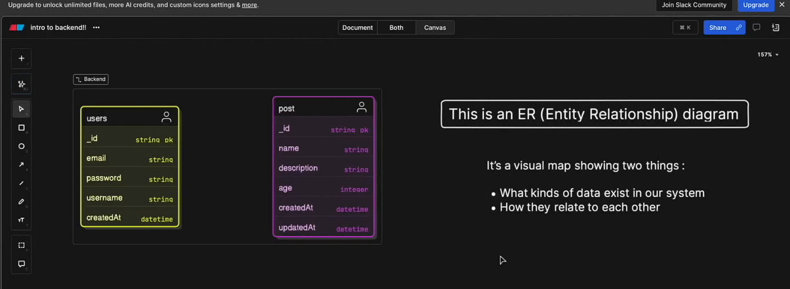
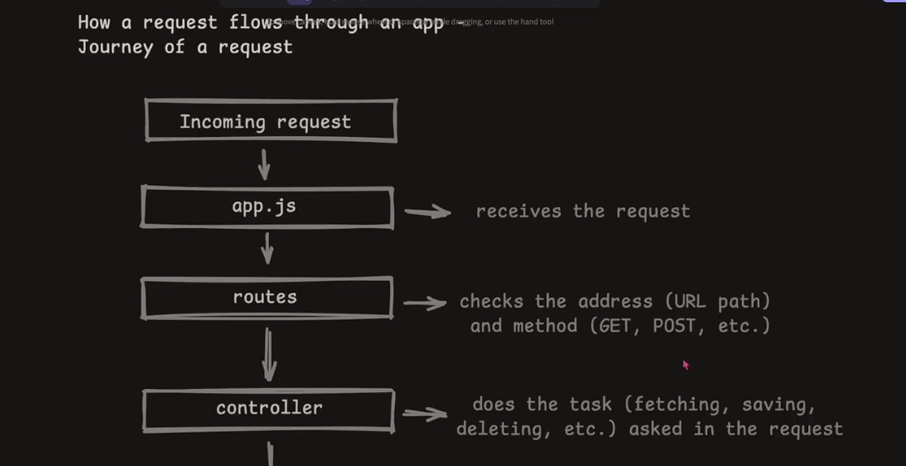
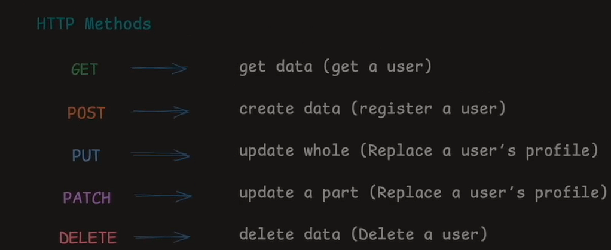
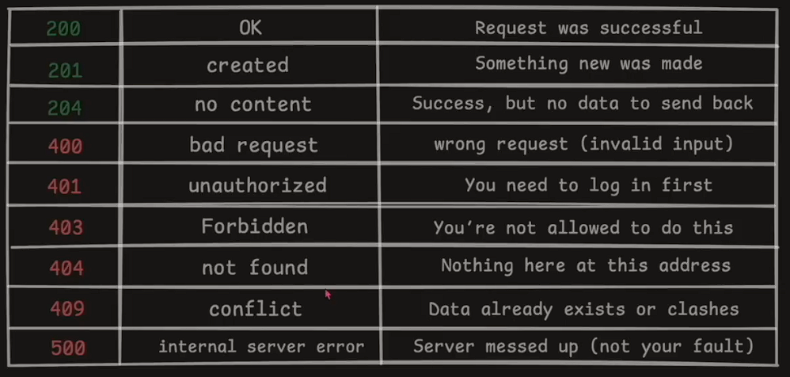

# Backend : A basic guide

Backend => brain behind a website.

it handles
user data and auth and talk to databse.
storing+retrieving info
sending the right response to the right request

# Components of backend


# Working of backend


# how both connected


user req to server

server res to user

# Structure


1. package.json : all the metadata of project kept library etc.

# connecting to a databse.

uri=

express : create server

mongoose : talk to backend

- connecting backend to database.

```js
import mongoose from "mongoose";
import { DB_NAME } from "./contants.js";

const connectDB = async () => {
  try {
    const connection = await mongoose.connect(
      `${process.env.MONGODB_URL}${DB_NAME}`
    );
    console.log(`MongoDB connected: ${connection.connection.host}`);
  } catch (error) {
    console.log("MongoDB connectoin failed", error);
    process.exit(1);
  }
};

export default connectDB;
```

### creating a server

index.js : this is the main file where we will run our server.

dotenv : it is used to use our environment variables.

```js
dotenv.config({
  path: "./.env",
});
```

after importing dotenv we use the path to tell from where our env vaariables come.

---

### Creating our server

````bash
src
  constant.js // will have all the constant variables such as databse name, api key etc.
  databse.js // it will have a function which will use mongoose to connect with database
app.js // will have express imported in a variable
  import express from "express";
  const app = express();
  export default app;


index.js // main file that will start our server.


```js
import dotenv from "dotenv";
import connectDB from "./config/database.js";
import app from "./app.js";

dotenv.config({
  path: "./.env",
});


const startServer = async () => {
  try {
    await connectDB();

    app.on("error", (err) => {
      console.log("Error", err);
      throw err;
    });
    app.listen(process.env.PORT || 4000, () => {
      console.log("Server running at port : ", process.env.PORT);
    });
  } catch (err) {
    console.log("MongoDb connection error", err);
    throw err;
  }
};

startServer();
````

---

---

### Creating API's and login logout entity relations

Model : code version of structure of the data that we want in our website. basically how we want to represent data in website.

- they define schemas



entity relation

Users : for authentication.

post : its for character we can post on websites.

Schema : structure

- it show what kind of data on our system
- how they are relate to each other

userModel

```js
import mongoose, { Schema } from "mongoose";

const userSchema = new Schema(
  {
    username: {
      type: String,
      required: true,
      unique: true,
      lowercase: true,
      trim: true, //
      minLength: 3,
      maxLength: 30,
    },
    password: {
      type: String,
      required: true,
      minLength: 6,
      maxLength: 30,
    },
    email: {
      type: String,
      required: true,
      unique: true,
      lowercase: true,
      trim: true, //
    },
  },
  { timestamps: true }
);

export const User = mongoose.model("User", userSchema);
```

### Routes

```js
// user.routes.js

import { User } from "../models/user.model.js";

const registerUser = async (req, res) => {
  try {
    const { username, email, password } = req.body;

    // basic validation

    if (!username || !email || !password) {
      return res.status(400).json({ message: "All the feild are mandatory !" });
    }

    // if user already exist

    const existingUser = await User.findOne({ email: email.toLowerCase() });

    if (existingUser)
      return res.status(400).json({ message: "User already exist!" });

    // create user

    const user = await User.create({
      username,
      email: email.toLowerCase(),
      password,
      loggedIn: false,
    });

    res.status(201).json({
      message: "User registered",
      user: { id: user._id, email: user.email, username: user.username },
    });
  } catch (err) {
    res.status(500).json({ message: "Internal server error", err });
  }
};

export { registerUser };
```

### req flow



### HTTP methods

- used for communications amongts the compuers
- used by browsers Postman curl etc to req and send data.

```bash
ex:
  https://example.com/api/users

https: protocol
//example.com : domain name
/api/users : path => tell the server which resource you are asking for.

```



### https status code


