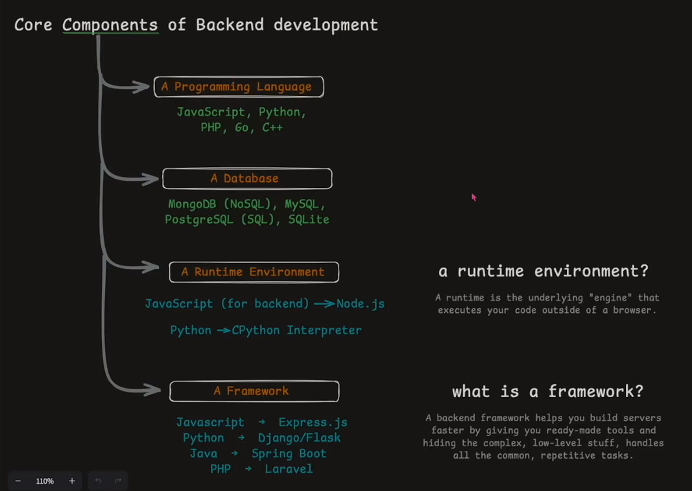
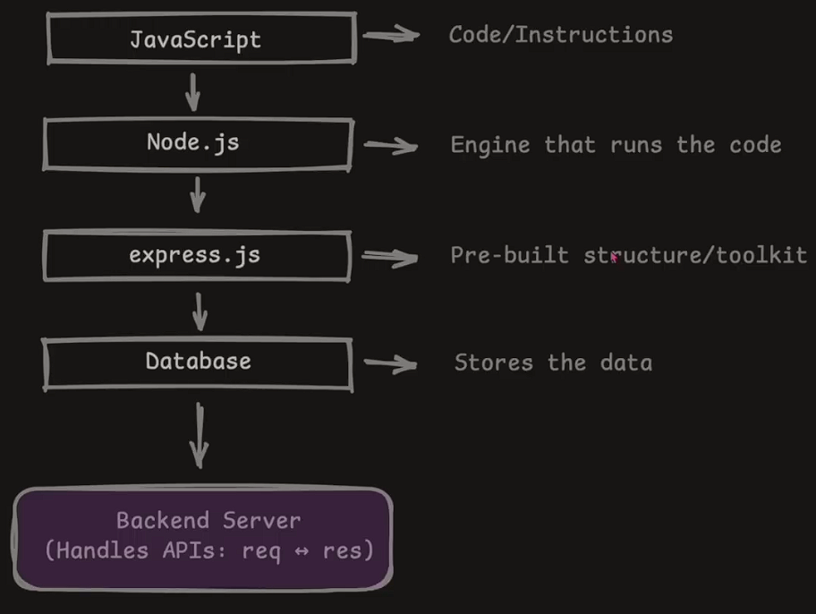
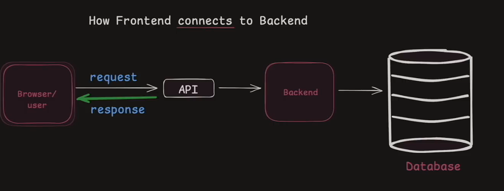
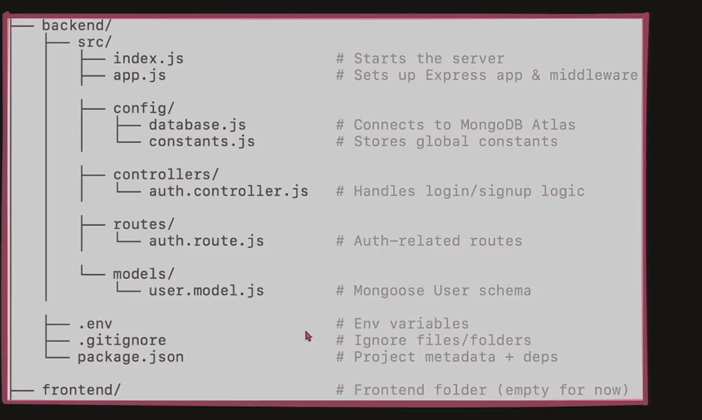

# Backend : A basic guide

Backend => brain behind a website.

it handles
user data and auth and talk to databse.
storing+retrieving info
sending the right response to the right request

# Components of backend



# Working of backend



# how both connected



user req to server

server res to user

# Structure



1. package.json : all the metadata of project kept library etc.

# connecting to a databse.

uri=

express : create server

mongoose : talk to backend

- connecting backend to database.

```js
import mongoose from "mongoose";
import { DB_NAME } from "./contants.js";

const connectDB = async () => {
  try {
    const connection = await mongoose.connect(
      `${process.env.MONGODB_URL}${DB_NAME}`
    );
    console.log(`MongoDB connected: ${connection.connection.host}`);
  } catch (error) {
    console.log("MongoDB connectoin failed", error);
    process.exit(1);
  }
};

export default connectDB;
```

### creating a server

index.js : this is the main file where we will run our server.

dotenv : it is used to use our environment variables.

```js
dotenv.config({
  path: "./.env",
});
```

after importing dotenv we use the path to tell from where our env vaariables come.

---

### Creating our server

````bash
src
  constant.js // will have all the constant variables such as databse name, api key etc.
  databse.js // it will have a function which will use mongoose to connect with database
app.js // will have express imported in a variable
  import express from "express";
  const app = express();
  export default app;


index.js // main file that will start our server.


```js
import dotenv from "dotenv";
import connectDB from "./config/database.js";
import app from "./app.js";

dotenv.config({
  path: "./.env",
});


const startServer = async () => {
  try {
    await connectDB();

    app.on("error", (err) => {
      console.log("Error", err);
      throw err;
    });
    app.listen(process.env.PORT || 4000, () => {
      console.log("Server running at port : ", process.env.PORT);
    });
  } catch (err) {
    console.log("MongoDb connection error", err);
    throw err;
  }
};

startServer();
````

```
```

--- 
